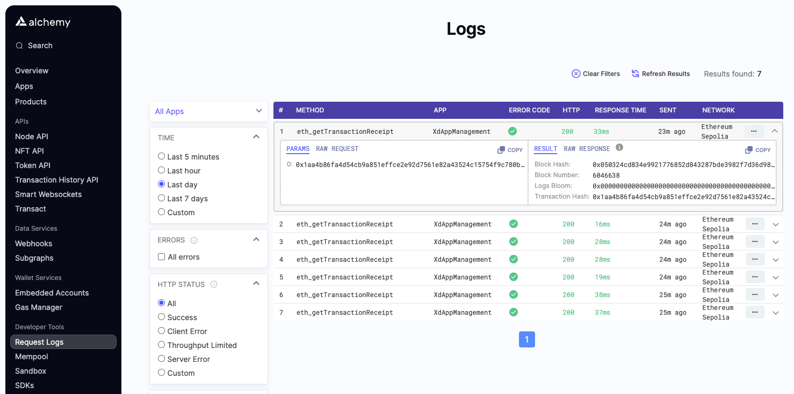
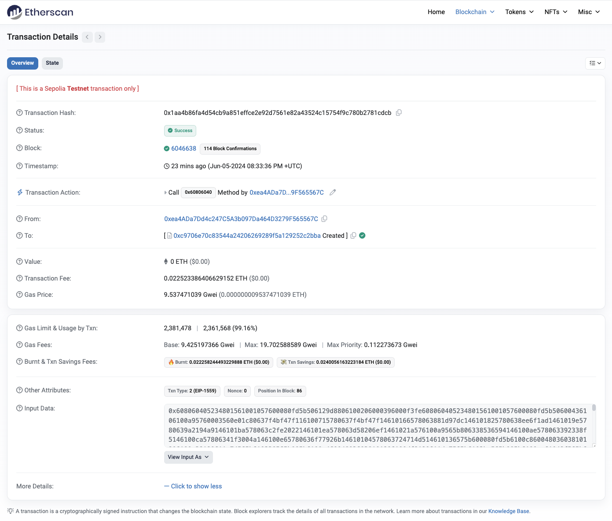

# Despliegue de un Contrato Inteligente en la Testnet de Sepolia Usando Hardhat

## Prerrequisitos

- Node.js y npm instalados
- Cuenta en Alchemy

## Guía Paso a Paso

### 1. Instalar Hardhat

Abrimos nuestra terminal y crearemos un nuevo directorio de proyecto:
```bash
mkdir dApp-x-2
cd dApp-x-2
```

Inicializa un nuevo proyecto npm:
```bash
npm init -y
```

Instala Hardhat:
```bash
npm install --save-dev hardhat
```

Crea un nuevo proyecto Hardhat y seleccionamos Typescript
```bash
$ npx hardhat init

888    888                      888 888               888
888    888                      888 888               888
888    888                      888 888               888
8888888888  8888b.  888d888 .d88888 88888b.   8888b.  888888
888    888     "88b 888P"  d88" 888 888 "88b     "88b 888
888    888 .d888888 888    888  888 888  888 .d888888 888
888    888 888  888 888    Y88b 888 888  888 888  888 Y88b.
888    888 "Y888888 888     "Y88888 888  888 "Y888888  "Y888

👷 Welcome to Hardhat v2.22.5 👷‍

? What do you want to do? …
  Create a JavaScript project
❯ Create a TypeScript project
  Create a TypeScript project (with Viem)
  Create an empty hardhat.config.js
  Quit
```

### 2. Configurar TypeScript

Instala TypeScript y dependencias relacionadas (solo si es necesario):
```bash
npm install --save-dev typescript ts-node @types/node
```

Crea un archivo `tsconfig.json`:
```json
{
  "compilerOptions": {
    "target": "es6",
    "module": "commonjs",
    "strict": true,
    "esModuleInterop": true,
    "skipLibCheck": true,
    "forceConsistentCasingInFileNames": true,
    "outDir": "./dist"
  },
  "include": ["./scripts", "./test", "./typechain-types"],
  "files": ["./hardhat.config.ts"]
}
```

### 3. Configurar Alchemy

Regístrate en Alchemy y crea una nueva aplicación en la red Sepolia. Obtén tu clave API del dashboard.

### 4. Configurar Variables de Entorno

Establece tu clave API de Alchemy y tu clave privada de Sepolia:
```bash
npx hardhat vars set ALCHEMY_API_KEY
# Ingresa tu clave API de Alchemy cuando se te solicite

npx hardhat vars set SEPOLIA_PRIVATE_KEY
# Ingresa tu clave privada de Sepolia cuando se te solicite
```

Para poder listar las variables seteadas ara hardhat podemos hacer uso del comando:
```bash
npx hardhat vars list
```
Esto listará el listado de tus variables y la ubicación.

### 5. Actualizar `hardhat.config.ts`

Crea o actualiza el archivo `hardhat.config.ts`:
```typescript
import { HardhatUserConfig } from "hardhat/config";
import "@nomicfoundation/hardhat-toolbox";
import "@nomicfoundation/hardhat-ignition";

const config: HardhatUserConfig = {
  solidity: "0.8.24",
  networks: {
    sepolia: {
      url: `https://eth-sepolia.alchemyapi.io/v2/${process.env.ALCHEMY_API_KEY}`,
      accounts: [process.env.SEPOLIA_PRIVATE_KEY]
    }
  }
};

export default config;
```

### 6. Crear Script de Despliegue

Crea un nuevo script de despliegue en `ignition/modules/XdAppManagement.ts`:
```typescript
import { buildModule } from "@nomicfoundation/hardhat-ignition/modules";

export default buildModule("XdAppManagementModule", (m) => {
  const xdAppManagement = m.contract("XdAppManagement", []);
  return { xdAppManagement };
});
```

### 7. Compilar el Contrato

Compila tu contrato:
```bash
npx hardhat compile
```

### 8. Desplegar el Contrato

Despliega tu contrato en la testnet de Sepolia:
```bash
npx hardhat ignition deploy ignition/modules/XdAppManagement.ts --network sepolia
```

### Confirmación del Despliegue

Deberías ver una salida similar a:
```
✔ Confirm deploy to network sepolia (11155111)? … yes
Hardhat Ignition 🚀

Deploying [ XdAppManagementModule ]

Batch #1
  Executed XdAppManagementModule#XdAppManagement

[ XdAppManagementModule ] successfully deployed 🚀

Deployed Addresses

XdAppManagementModule#XdAppManagement - 0xc9706e70c83544a24206269289f5A129252C2BbA
```

### Verificar la red de tesnet de despliegue 
```bash
npx hardhat ignition verify sepolia-deployment
```

### Logs

Alchemy log



Etherscan log




## Recursos
- [Documentación de Hardhat: Desplegar en Redes Remotas](https://hardhat.org/tutorial/deploying-to-a-live-network#deploying-to-remote-networks)
- [Documentación de Alchemy: Cómo Configurar Hardhat](https://docs.alchemy.com/docs/how-to-set-up-hardhat)